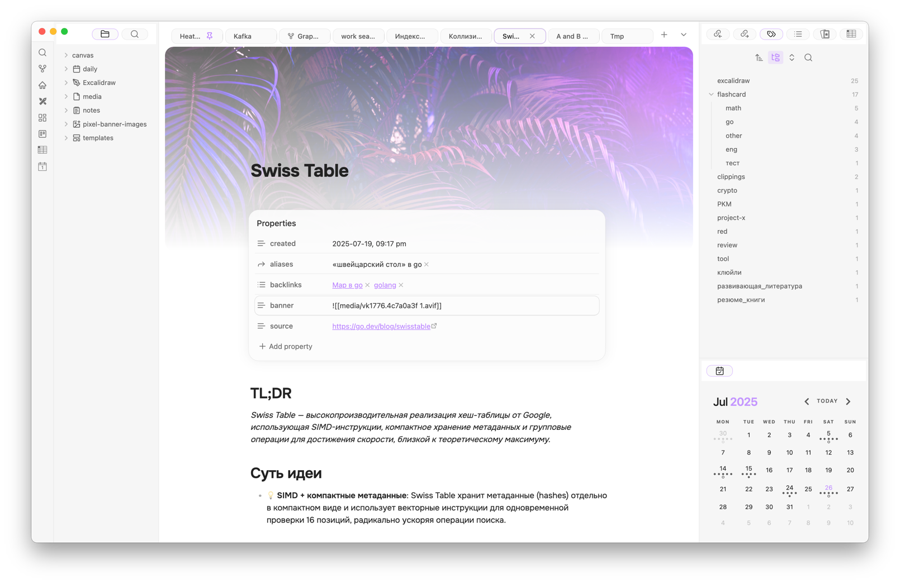
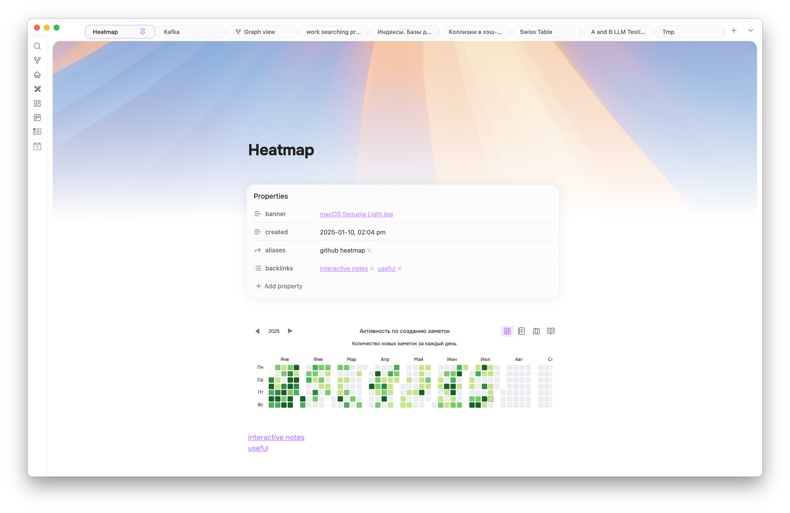
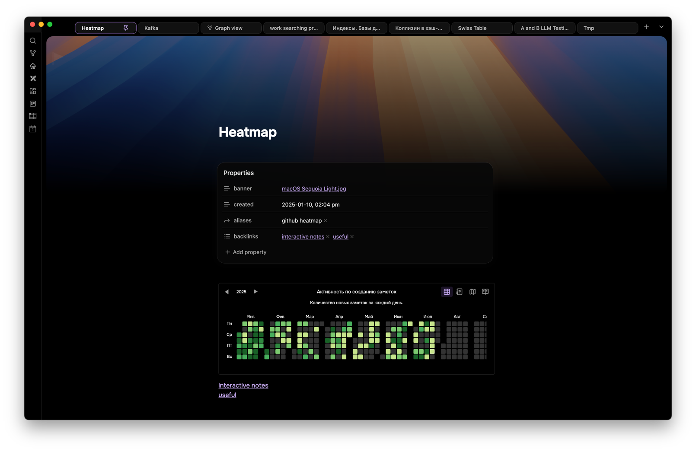
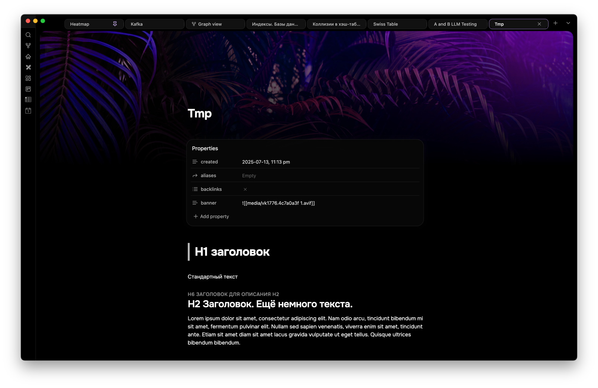
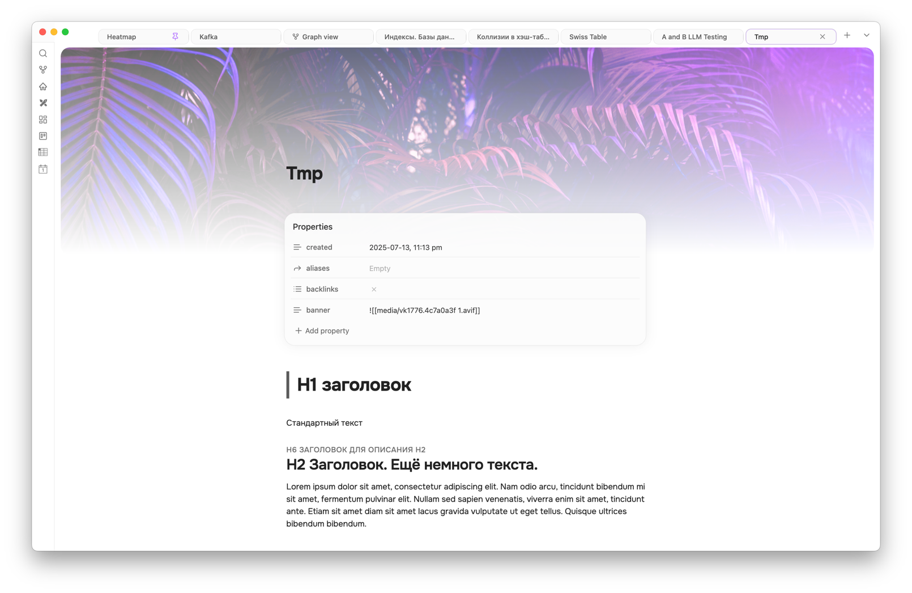
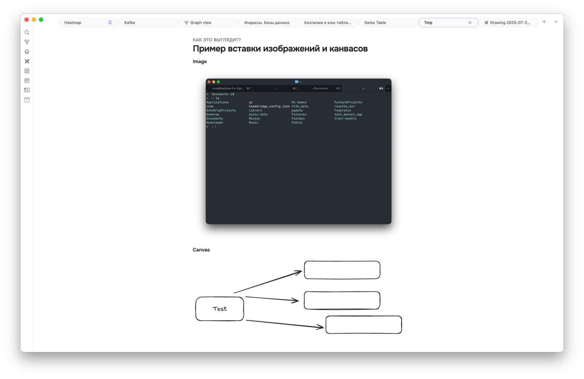
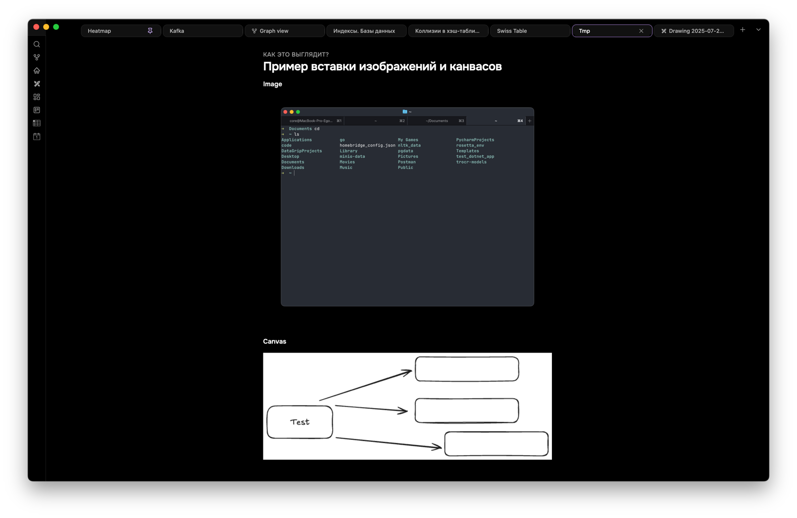

# Vanilla Amoled Rounded Obsidian Theme

Кастомный форк темы Vanilla Amoled с улучшенной читаемостью и удобством использования.

## Основные особенности

* **Шрифт Onest**: Максимальная читаемость и комфорт для глаз.
* **Полная ширина**: Изображения, холсты, канвасы и другие элементы автоматически растягиваются на всю ширину заметки.
* **Поддержка баннеров**: Опциональная интеграция с плагином Pixel Banner для удобного использования баннеров в заметках.
* **Улучшенные стили заголовков**: Заголовки стали еще более читаемыми и визуально приятными.
* **Исправленные стили таблиц**: Полная совместимость с плагином Advanced Tables. Таблицы теперь имеют закруглённые углы и горизонтальную прокрутку при превышении ширины заметки.

## Как установить

1. Скачайте и поместите папку темы в `.obsidian/themes` вашего хранилища.
2. Перезапустите Obsidian.
3. Выберите тему `Vanilla Amoled Rounded` в настройках Obsidian и наслаждайтесь удобной и стильной работой.

## Screenshots

