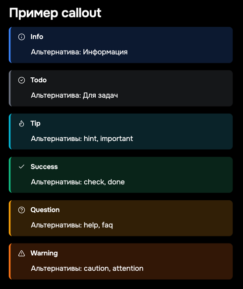
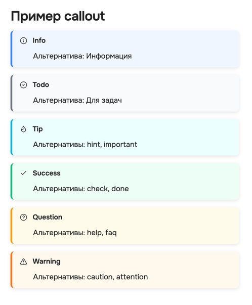

# Vanilla Amoled Rounded Obsidian Theme

Кастомный форк темы Vanilla Amoled с улучшенной читаемостью и удобством использования.

## Screenshots

## Основные особенности

* **Шрифт Onest**: Максимальная читаемость и комфорт для глаз.
* **Полная ширина**: Изображения, холсты, канвасы и другие элементы автоматически растягиваются на всю ширину заметки.
* **Поддержка баннеров**: Опциональная интеграция с плагином Pixel Banner для удобного использования баннеров в заметках.
* **Улучшенные стили заголовков**: Заголовки стали еще более читаемыми и визуально приятными.
* **Исправленные стили таблиц**: Полная совместимость с плагином Advanced Tables. Таблицы теперь имеют закруглённые углы и горизонтальную прокрутку при превышении ширины заметки.

## Изменения относительно оригинальной Vanilla AMOLED

| Область                       | Что изменилось                                                                                                            | Почему это важно                                                                        |
| ----------------------------- | ------------------------------------------------------------------------------------------------------------------------- | --------------------------------------------------------------------------------------- |
| **Типографика**               | Подключён шрифт **Onest** для всех режимов просмотра и редактирования                                                     | Улучшена читаемость и единый внешний вид на разных ОС                                   |
| **Палитра AMOLED**            | Базовые переменные `--color-base-*` сконфигурированы в абсолютные чёрные (#000 — #222)                                    | Настоящая «AMOLED‑чёрная» экономит энергию на OLED‑экранах и делает контент контрастнее |
| **Metadata‑блоки**            | Контейнеры свойств имеют округление 20 px, деликатную обводку и мягкую тень                                               | Визуально отделяет метаданные от текста, при этом не отвлекает                          |
| **Заголовки**                 | Переработаны размеры, веса и цвета; `h1` получает цветную левую полосу, `h6` — uppercase                                  | Легче сканировать структуру заметки и быстро находить нужный раздел                     |
| **Таблицы (Advanced Tables)** | Полностью переопределён стиль для чтения, Live Preview и редактора: 8–15 px радиус, цветные хэдеры, горизонтальный скролл | Таблицы выглядят современно, не «ломают» макет и остаются пригодными на мобильных       |
| **Изображения**               | Все `` растягиваются на 100 % ширины контейнера без потери пропорций                                                 | Больше не нужно вручную регулировать размеры картинок                                   |
| **Вкладки (Safari‑style)**    | Заголовки вкладок получили скругления, состояние «active» с акцентной рамкой, плавные hover‑эффекты                       | Навигация становится опрятнее и понятнее                                                |
| **Микро‑UX оптимизации**      | Короткие (.2 s) transition‑эффекты, `cursor:pointer` на интерактивных элементах, мягкие box‑shadow                        | Интерфейс отзывчивее, а интерактивность очевиднее                                       |
| **Кодовая база**              | Убраны дублирующие селекторы, сокращено количество `!important`, комментарии сгруппированы                                | Легче поддерживать и дорабатывать тему                                                  |

## Как установить

1. Скачайте и поместите папку темы в `.obsidian/themes` вашего хранилища.
2. Перезапустите Obsidian.
3. Выберите тему `Vanilla Amoled Rounded` в настройках Obsidian и наслаждайтесь удобной и стильной работой.

## Обновления

### 1.1.0

#### Исправлены ошибки дизайна

В определённых местах не работали скругления

#### Исправлен дизайн callouts

