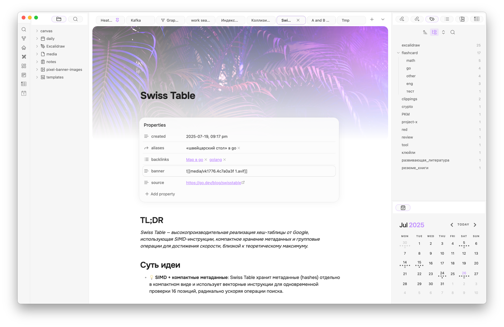
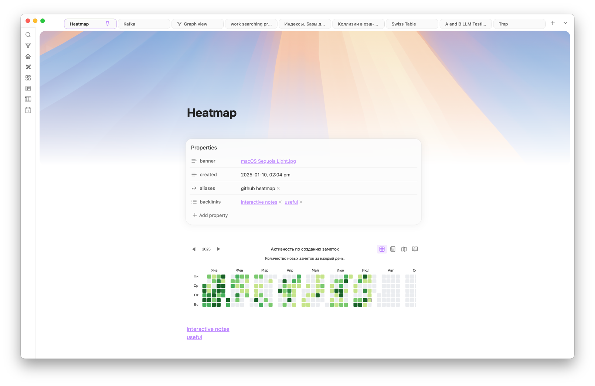
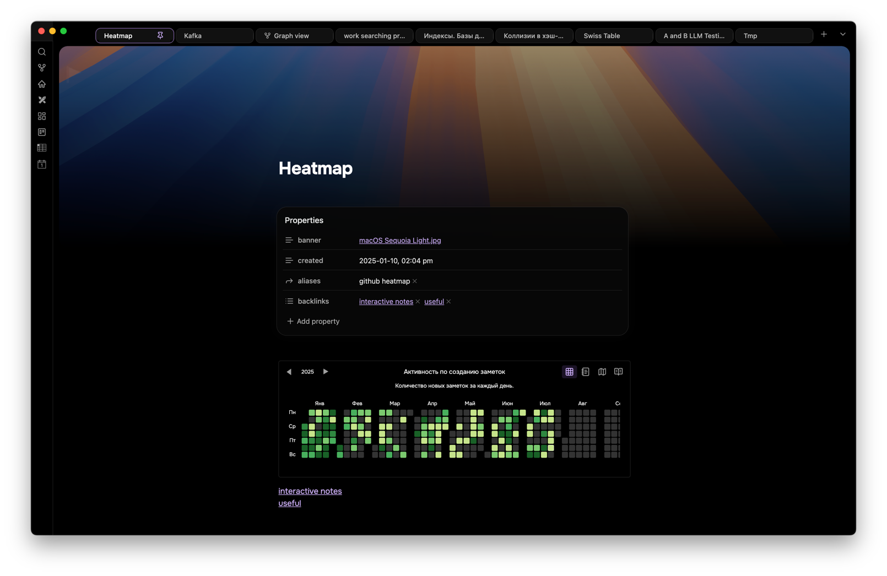
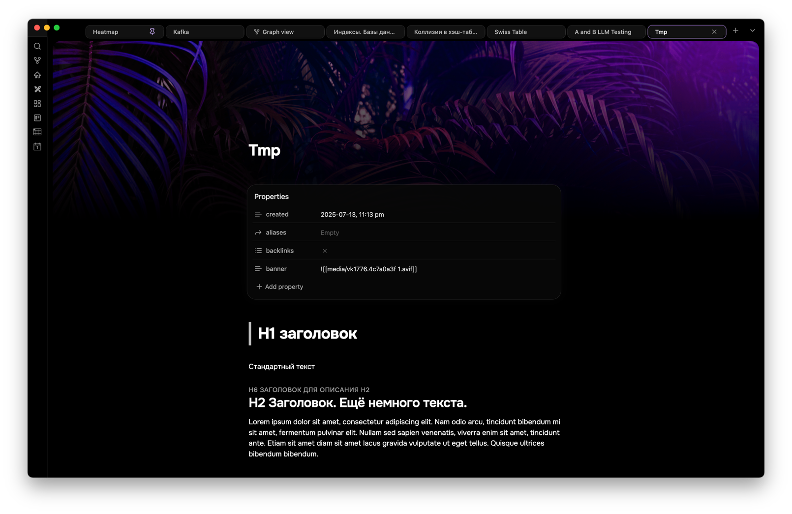
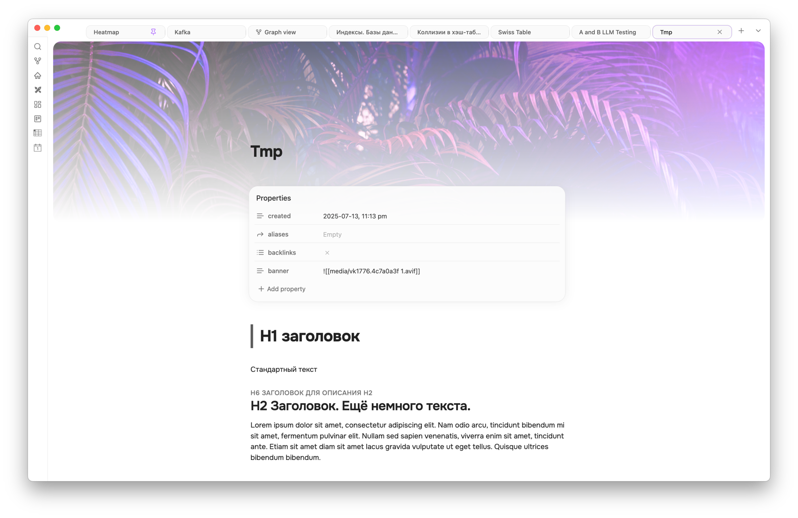
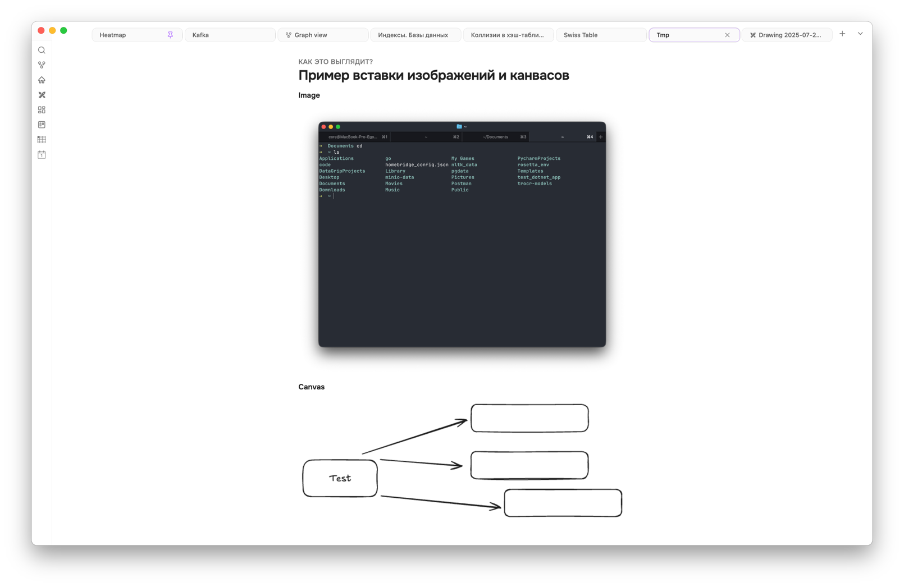
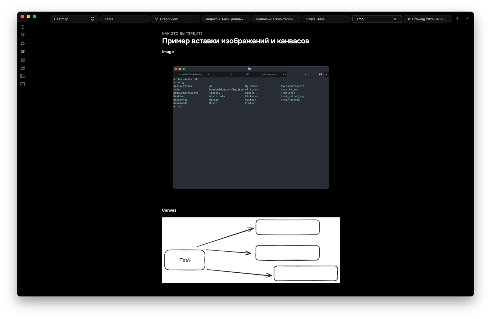
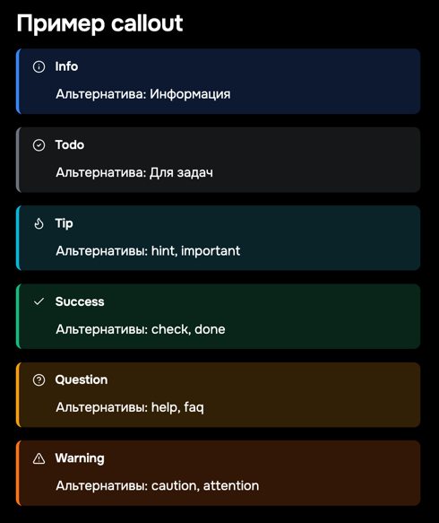
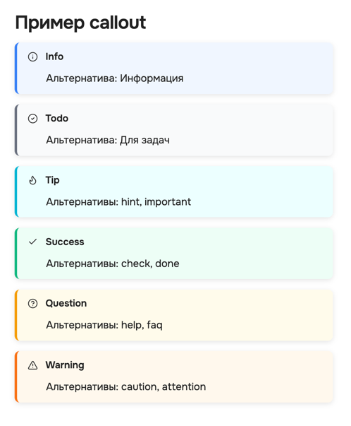

# Vanilla Amoled Rounded Obsidian Theme

Кастомный форк темы Vanilla Amoled с улучшенной читаемостью и удобством использования.

## ВАЖНО

Чтобы установить тему, папка с темой должна называться «Vanilla Amoled Rounded»

## Screenshots

## Основные особенности

* **Шрифт Onest**: используется локально установленный Onest с системным fallback — тема не загружает внешние ресурсы.
* **Адаптивные изображения**: изображения не выходят за ширину заметки и сохраняют размеры, заданные пользователем.
* **Поддержка баннеров**: Опциональная интеграция с плагином Pixel Banner для удобного использования баннеров в заметках.
* **Улучшенные стили заголовков**: Заголовки стали еще более читаемыми и визуально приятными.
* **Исправленные стили таблиц**: Полная совместимость с плагином Advanced Tables. Таблицы теперь имеют закруглённые углы и горизонтальную прокрутку при превышении ширины заметки.

## Изменения относительно оригинальной Vanilla AMOLED

| Область                       | Что изменилось                                                                                                            | Почему это важно                                                                        |
| ----------------------------- | ------------------------------------------------------------------------------------------------------------------------- | --------------------------------------------------------------------------------------- |
| **Типографика**               | Подключён шрифт **Onest** для всех режимов просмотра и редактирования                                                     | Улучшена читаемость и единый внешний вид на разных ОС                                   |
| **Палитра AMOLED**            | Базовые переменные `--color-base-*` сконфигурированы в абсолютные чёрные (#000 — #222)                                    | Настоящая «AMOLED‑чёрная» экономит энергию на OLED‑экранах и делает контент контрастнее |
| **Metadata‑блоки**            | Контейнеры свойств имеют округление 20 px, деликатную обводку и мягкую тень                                               | Визуально отделяет метаданные от текста, при этом не отвлекает                          |
| **Заголовки**                 | Переработаны размеры, веса и цвета; `h1` получает цветную левую полосу, `h6` — uppercase                                  | Легче сканировать структуру заметки и быстро находить нужный раздел                     |
| **Таблицы (Advanced Tables)** | Полностью переопределён стиль для чтения, Live Preview и редактора: 8–15 px радиус, цветные хэдеры, горизонтальный скролл | Таблицы выглядят современно, не «ломают» макет и остаются пригодными на мобильных       |
| **Изображения**               | Изображения ограничены шириной контейнера и сохраняют заданные размеры                                                   | Не ломает миниатюры и снижает лишнюю перерисовку на мобильных устройствах               |
| **Вкладки (Safari‑style)**    | Заголовки вкладок получили скругления, состояние «active» с акцентной рамкой, плавные hover‑эффекты                       | Навигация становится опрятнее и понятнее                                                |
| **Микро‑UX оптимизации**      | Короткие (.2 s) transition‑эффекты, `cursor:pointer` на интерактивных элементах, мягкие box‑shadow                        | Интерфейс отзывчивее, а интерактивность очевиднее                                       |
| **Кодовая база**              | Убраны дублирующие селекторы, сокращено количество `!important`, комментарии сгруппированы                                | Легче поддерживать и дорабатывать тему                                                  |

## Как установить

1. Скачайте и поместите папку темы в `.obsidian/themes` вашего хранилища.
2. Перезапустите Obsidian.
3. Выберите тему `Vanilla Amoled Rounded` в настройках Obsidian и наслаждайтесь удобной и стильной работой.

## Настройка шрифта заголовков

По умолчанию заголовки используют Georgia. Для изменения установите community-плагин **Style Settings**, затем откройте **Настройки → Style Settings → Vanilla Amoled Rounded**. Там можно изменить шрифт заголовков и радиус вкладок.

## Обновления

### 1.2.9

* восстановлено стандартное переполнение контейнера и горизонтальная прокрутка вкладок;
* активная вкладка получила контрастную акцентную рамку толщиной 2 px.

### 1.2.8

* увеличен нижний отступ между вкладками и панелью заметки;
* удалены внутренние outline, тени и псевдоэлементы, создававшие двойное выделение вкладки;
* стрелка сворачивания Properties возвращена внутрь заголовка;
* прямоугольное затемнение заголовка баннера заменено компактной тенью текста.

### 1.2.7

* вкладки уменьшены и смещены вверх, чтобы не пересекать подложку панели заметки;
* неактивные вкладки больше не получают серую заливку при наведении — меняется только обводка.

### 1.2.6

* заголовок Pixel Banner получил контрастную полупрозрачную подложку и белый текст;
* вкладки подняты над подложкой, а их высота ограничена высотой панели для полной обводки;
* фон вложенных полей Properties при наведении больше не становится белым.

### 1.2.5

* добавлен `cursor: pointer` для кнопок, вкладок, ссылок, пунктов навигации, меню, тегов и элементов свойств;
* отключённые элементы используют `cursor: not-allowed`.

### 1.2.4

* поисковые поля используют такое же скругление, как вкладки;
* заголовок Pixel Banner принудительно использует выбранный шрифт заголовков;
* баннеры в светлой теме меньше выцветают и сохраняют контрастность.

### 1.2.3

* синхронизированы семейство, размеры, веса и высота строки заголовков в Reading view и Live Preview;
* одинаковая левая полоса H1 теперь отображается в обоих режимах;
* вкладки получили вертикальные отступы и больше не обрезаются нижней границей панели.

### 1.2.2

* заголовки переведены на Georgia;
* добавлены настройки шрифта заголовков и радиуса вкладок через Style Settings;
* вкладки разделены промежутками и отображаются отдельными скруглёнными прямоугольниками;
* восстановлен системный отступ от macOS traffic lights.

### 1.2.1

#### Совместимость с актуальным Obsidian

* восстановлены маркеры нумерованных и маркированных списков;
* исправлена геометрия выделения и курсора в заголовках;
* удалена внешняя загрузка Google Fonts;
* упрощены тяжёлые стили таблиц и мобильные hover-эффекты;
* изображения снова учитывают размеры, заданные в Markdown.

### 1.2.0

#### Исправлены стили таблиц

### 1.1.0

#### Исправлены ошибки дизайна

В определённых местах не работали скругления

#### Исправлен дизайн callouts

